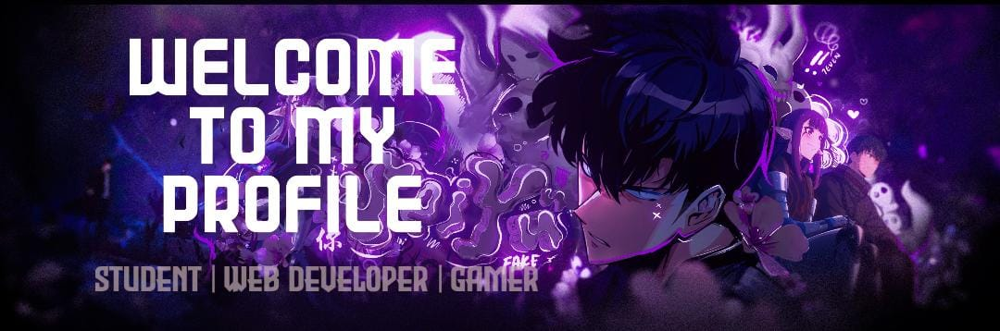

## Hi World I'm Boyke Salehu 👋

### About Me:
Hi there! I'm a student with a growing passion for programming.  
Currently learning exciting languages like:
- Python (exploring CustomTkinter for desktop apps)
- PHP & JavaScript for web development
I believe that every line of code is a step forward.  
Still learning, still growing — one project at a time. 

### Tech Stack:

             

###

###

### Socials:
    
### GitHub Stats:
 
 

### Random Video

<h5 align="left">Play Game With Me</h5>

###

<picture>
  <source media="(prefers-color-scheme: dark)" srcset="https://raw.githubusercontent.com/boyke-ssd/boyke-ssd/output/pacman-contribution-graph-dark.svg">
  <source media="(prefers-color-scheme: light)" srcset="https://raw.githubusercontent.com/boyke-ssd/boyke-ssd/output/pacman-contribution-graph.svg">
  
</picture>

###